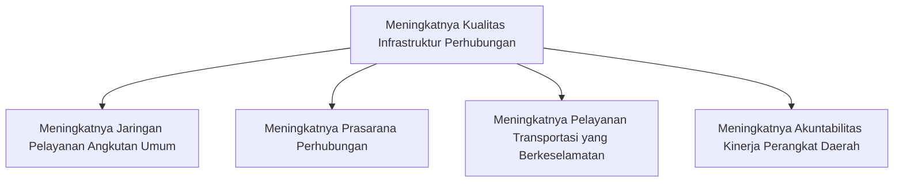

# Tahun Anggaran 2024

Dokumentasi Perencanaan Dinas Perhubungan Kabupaten Pasuruan Tahun Anggaran 2024.

## Tujuan pada Rencana Pembangunan Daerah Kabupaten Pasuruan (RPD)

** Meningkatnya Pertumbuhan dan Pemerataan Ekonomi Daerah **

## Sasaran pada RPD

** Meningkatnya Kualitas dan Pemerataan Infrastruktur Wilayah **

## Indikator Kinerja pada RPD

** Indeks Infrastruktur Wilayah **

## Tujuan pada Rencana Strategis Dinas Perhubungan Kabupaten Pasuruan (Renstra)

** Meningkatnya Kualitas Infrastruktur Perhubungan **

## Sasaran pada Renstra

1. Meningkatnya Jaringan Pelayanan Angkutan Umum
2. Meningkatnya Prasarana Perhubungan
3. Meningkatnya Pelayanan Transportasi yang Berkeselamatan
4. Meningkatnya Akuntabilitas Kinerja Perangkat Daerah

